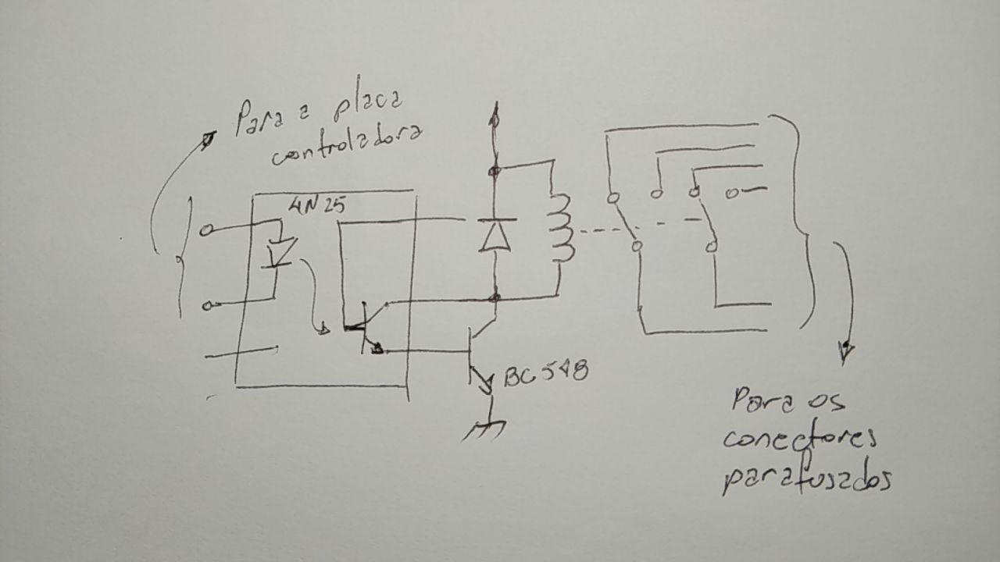
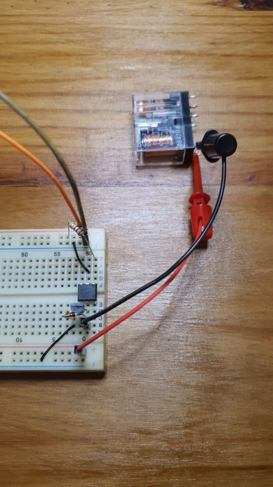
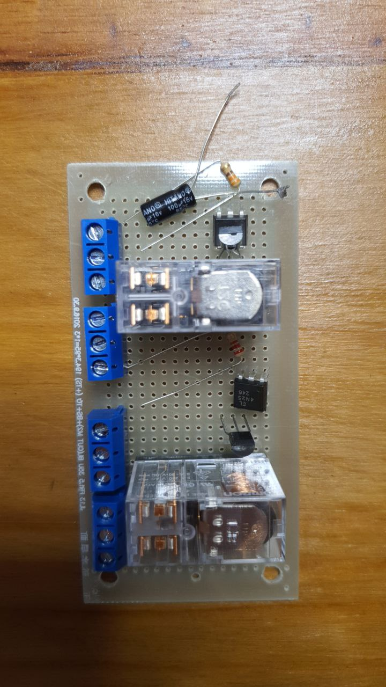
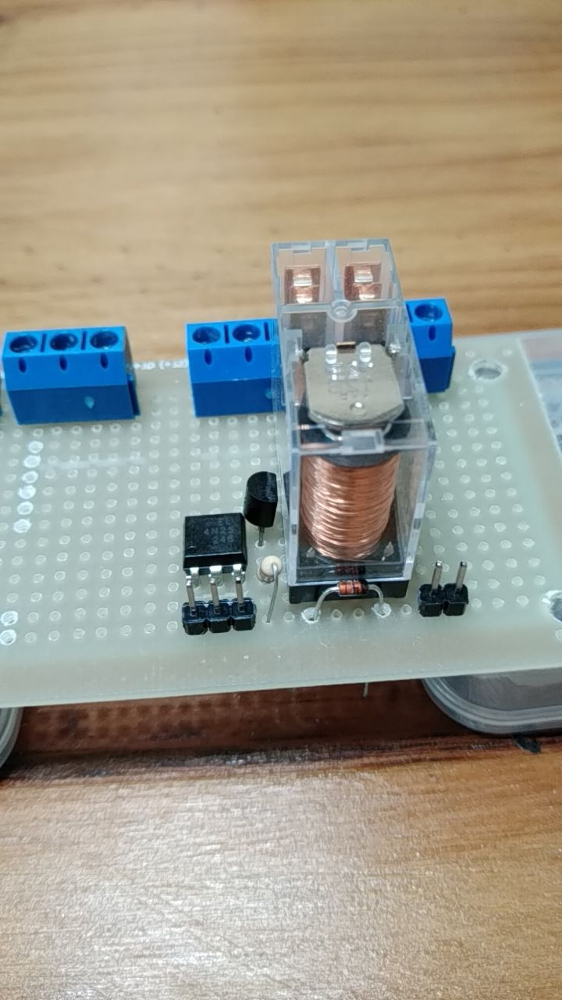
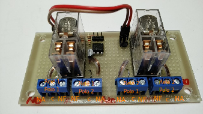

# Construção de um módulo de relés

## Objetivo

Construir uma módulo de relés para placas microcontroladoras como Arduino e ESP32.

## Motivação

Embora módulos de relés estejam comercialmente disponíveis, esses componentes ou acoplam eletricamente o(s) relé(s) ao circuito controlador ou invertem o sinal de controle. Essas características não são desejável nas aplicações.

### Módulos com acoplamento elétrico

### Módulos que invertem o sinal de controle

## Método

- Analisar especificação dos componentes;
- Testar o relé;
- Testar o uso do acoplador óptico;
- Projetar o circuito;
- Construir em protoboard um protótipo do módulo;
- Construir em placa padrão de circuito impresso um protótipo do módulo.

## Resultados

### Análise da especificação dos componentes

Relés com caixa transparente e tensão de bobina de 5V não foram encontrados no mercado nacional, então foram importados. O modelo escolhido é o Omron G2R-2-5VDC [datasheet](https://www.allaboutcircuits.com/electronic-components/datasheet/G2R-2-DC5--Omron/), tem 2 pólos e 2 posições. A resistência da bobina é de $47 \Omega$, a corrente nominal é 106mA.

O acoplador óptico encontrado no mercado nacional foi o 4N25 [datasheet](https://www.vishay.com/docs/83725/4n25.pdf). Pelo datasheet, a 5V, a corrente máxima que o optoacoplador é capaz de controlar é 60mA.

### Teste do relé

Foram testadas duas unidades do relé. A corrente medida foi próxima de 90mA.

### Teste do optoacoplador

Tentou-se acionar o relé diretamente com optoacoplador, embora a corrente ultrapasse a da especificação deste. Sem polarizar a base do fototransistor, ao acender o LED o relé não é acionado.

### Projeto do circuito

Pelas especificações e pelos resultados dos testes, é necessário um transistor para amplificar o sinal e entregar mais corrente ao relé. O modelo escolhido foi o BC548 [datasheet](https://www.onsemi.com/pdf/datasheet/bc546-d.pdf), a configuração do circuito é Darlington por não inverter o sinal e não usar componentes adicionais.

Foi acrescentado um diodo de sinal para atenuar a corrente transiente de desligamento do relé e um resistor para limitar a corrente de acendimento do LED.

### Construção e teste no protoboard

Serve também para dimensionar valores de componentes como resistores.

### Construção e teste em placa de circuito impresso padrão

#### Posicionamento dos componentes na placa de circuito impresso

O posicionamento foi pensado considerando as funções (conexão com outras placas são posicionadas preferencialmente nas bordas, seções do circuito (acoplamento com circuito de controle longe da bobina e esta longe das conexões com contatos - pois estes podem ser ligados a níveis de tensão de até 250V. Por último, convém que as conexões sejam feitas dobrando e soldando os terminais dos componentes, isto garante que um dos componentes está conectado e poupa o montador de lidar com fios muito curtos. ).

Os três pinos próximos ao optoacoplador acionam o LED e podem ser ligados à placa controladora. Os dois pinos do outro lado fornecem energia para o relé e para o transistor. Os conectores parafusados (ao fundo) estão conectados aos polos do relé. O resistor é colocado por conveniência para a aplicação.

### Documentação para aplicação

./msg2111134040-2395.jpg

## Discussão

- A posição dos conectores dos contatos do relé pode levar a engano pois, considerando os dois polos do mesmo relé, eles são espelhados ao invés de serem iguais.

