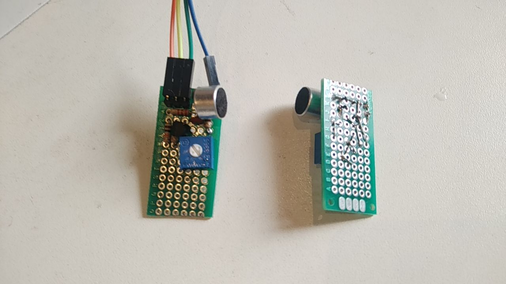

# Sensor de som, parte 2

### Apresentação e motivação

Na [parte 1](README.md), desenvolvida aqui, o circuito resultante foi montado em protoboard e os valores dos resistores e circuito de controle (manual) de ganho a ser testado foi definido. Chegou-se ao diagrama esquemático:

Protoboard é uma ferramenta de prototipação que facilita a troca e conexão de componentes, acelerando o desenvolvimento, mas tem inconvenientes, dentre eles:

1. A oxidação dos terminais dos componentes e dos contatos do protoboard, bem como, o calibre dos terminais e a força das molas (dos contatos) pode causar mau-contato que, às vezes, é eliminado apenas encostando no terminal do componente. Este tipo de ocorrência confunde o projetista e lhe toma tempo;
2. Os componentes e jumpers raramente têm o tamanho ajustado. Há sobras, frequentemente terminais nus. Se um terminal encostar em outro ou, se um terminal encostar na carcaça metálica de outros componentes (ex. microfone), indevidamente, no mínimo, o circuito não funciona conforme o projetista esperava, o que o confunde e lhe toma tempo;
3. A montagem é difícil de transportar (ex. colocar o protótipo, em protoboard, em uma caixa dentro de uma sacola já movimenta os componentes e jumpers, podendo causar desconexões e curto-circuitos).

A esses inconvenientes, soma-se questão de custo: protoboard (ainda é) mais caro que uma placa de circuito impresso com furação e conexões padrão e cópias do protótipo necessitarão da presença do projetista para refazer ligações e eliminar curto-circuitos e mau-contatos.

Por esses motivos, neste momento, convém montar novos protótipos, desta vez em placa padrão de circuito impresso. Nessas placas os componentes são soldados e as conexões são feitas dobrando e soldando os terminais dos componentes, ou, soldando pedaços de fio.

### Método

1. Desenhei o leiaute dos componentes e ligações sobre a placa, no papel, até ter o circuito completo (claro), caber na placa e minimizar a quantidade de jumpers pelo lado dos componentes;
2. Numa placa de circuito impresso do mesmo modelo que pretendo usar (https://curtocircuito.com.br/placa-de-circuito-impresso-ilhada-dupla-face-2x8-cm.html), dispus os componentes para garantir que o espaço sobre a placa seja suficiente (não ter componentes "encavalados");
2. Peguei outra placa, cortei no tamanho que queria, posicionei os componentes mais baixo (no caso, os resistores), pelo avesso, dobrei os terminais conforme as ligações que deveriam ser feitas, com o cuidado de manter os componentes no lugar.
3. Soldei um dos terminais de cada resistor (para fixá-los à placa), posicionei, sequencialmente, os componentes mais altos, repetindo a operação de dobrar o terminal e soldar até que todos os componentes estivessem soldados. Isso resultou na montagem apresentada abaixo.

**nota**: Soldar (somente) um terminal, geralmente, é suficiente para fixar o componente à placa e permite algum reposicionamento (ex. reaquecer a solda do terminal e movê-lo um pouco para o lado ou extrair o componente, se necessário). Com dois ou mais terminais soldados, o reposicionamento fica mais difícil.

### Resultados

Desenhei no papel o leiaute e dispus na placa de circuito impresso (https://curtocircuito.com.br/placa-de-circuito-impresso-ilhada-dupla-face-2x8-cm.html): No papel, sucessivos desenhos. O primeiro, do lado superior-direito, o segundo do lado inferior-direito, até o último, do lado inferior-esquerdo. Do lado superior-esquerdo, a placa de circuito impresso com os componentes posicionados.

Peguei outra placa, cortei no tamanho que queria (metade), posicionei os componentes mais baixo (no caso, os resistores), pelo avesso, dobrei os terminais, com o cuidado de manter os componentes no lugar, conforme as ligações que deveriam ser feitas.
 

Soldei um dos terminais, posicionei, sequencialmente, os componentes mais altos, repetindo a operação de dobrar o terminal e soldar até que todos os componentes estivessem soldados. Isso resultou na montagem apresentada abaixo.

#### Testes

A conexão do header ao ESP32/Arduino é:

| Sensor de som | ESP32 | comentário |
| --- | --- | --- |
| 1 (mais distante do microfone) | Vcc (no ESP, 3,3V) | jumper laranja |
| 2 | GPIO2 | jumper amarelo |
| 3 | GND | jumper verde |

Os programas são os mesmos usados na [parte 1](README.md). O resultado (vídeo) é semelhante ao apresentado na parte 1.

### Comentários

Existem programas que fazem o leiaute automaticamente, para placa de circuito impresso (personalizada). A fabricação desse tipo de placa é encomendada em empresas especializadas. Para circuitos simples como este, é mais barato e mais rápido fazer o desenho manualmente.

Neste tipo de montagem, para mim, é comum acontecer algum ponto de solda mal feita, o que resulta em mau contato. Geralmente são difíceis de identificar visualmente, então, geralmente eu ligo o circuito e verifico o funcionamento, identificando e refazendo os pontos de solda.

### Próximo passo

Testar a variação do ganho.
