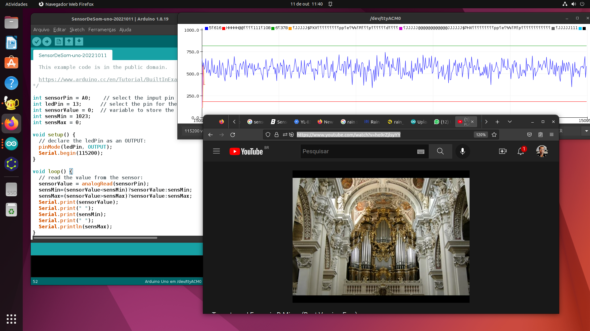
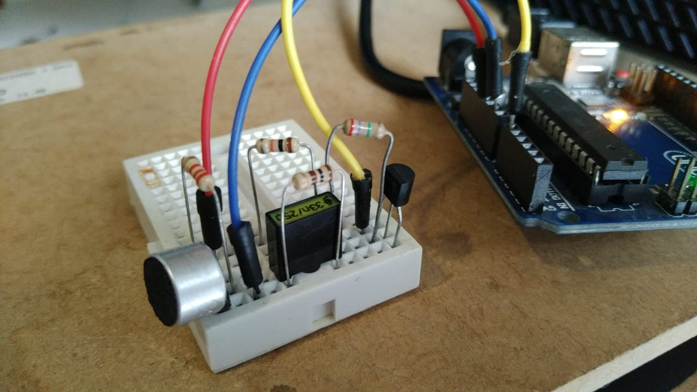
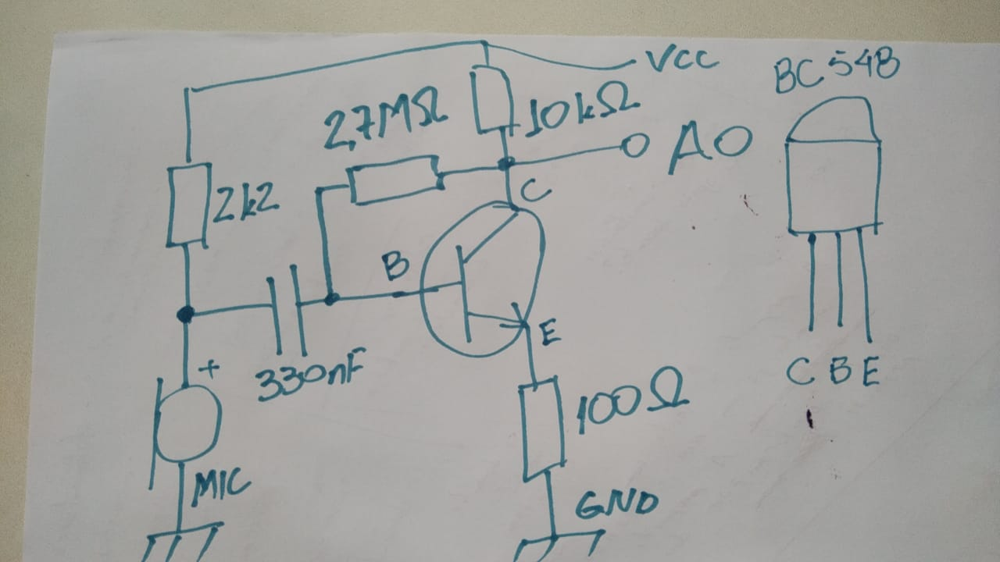

# Construção de um "sensor de som".



## Motivação

Apresentar uma alternativa mais intuitiva (fácil de trabalhar) para os sensores de som mais comuns ((e que são difíceis de trabalhar)) para Arduino e ESP32.

Figura 2: Sensor proposto neste projeto. Sua montagem e uso serão detalhados a seguir.



## Introdução

Os sensores de som para arduino mais comuns, como o desta foto do site da eletrogate: 

, segundo 

https://oshwlab.com/adrirobot/KY_038_Microphone_sound_sensor_module-283a631354c24d129bca349e77da0d18, tem este circuito: 

.

O circuito usa os amplificadores sem realimentação e com o microfone acoplado em DC (sem capacitor de desacoplamento), o que o faz muito sensível (provavelmente, inclusive a mudanças de temperatura). Nesta configuração, a resposta é muito não-linear e, às vezes, não determinística (porque não controlamos temperatura, ruído ambiente, ...). Isto dificulta a interpretação das medidas geradas pelo sensor. Consequemente, na minha opinião, tornando o sensor difícil de calibrar e trabalhar.

Por outro lado, há demanda por sensores de som, baratos, para Arduino, e preferencialmente que permitam medidas proporcionais, comparáveis entre si, ainda que um pouco distorcidas.

Ligar diretamente um microfone de computador a uma entrada analógica do arduino até funciona, mas a variação do valor lido na entrada analógica é muito pequena (para alguma aplicação, isso pode ser suficiente).

O seguinte circuito capta som e gera sinais com amplitude maior (é um amplificador a transistor). É um "sensor de som" mais adequado para determinadas aplicações.

## Montagem

### Lista de peças

| Quantidade | Código | orientação adicional |
| --- | --- | --- |
| 1 | Transistor BC548 | --- |
| 1 | Resistor ~~2,7~~ 2,2MOhm | ~~verm-lilas-verde~~ verm-verm-verde SE FOR ARDUINO UNO/MEGA |
| 1 | Resistor 1,3MOhm | marrom-laranja-verde SE FOR ESP32 |
| 1 | Resistor 10kOhm | marrom-preto-laranja |
| 1 | Resistor 2,2kOhm | vermelho-vermelho-vermelho |
| 1 | Resistor 100Ohm | marrom-preto-marrom |
| 1 | Capacitor cerâmico, poliéster ou outro não eletrolítico, de 330nF | --- |
| --- | Jumpers | --- |
| --- | Protoboard | para facilitar a conexão dos componentes |

### Ferramentas

Arduino UNO OU ESP32 e IDE do Arduino

### Programa para Arduino UNO e MEGA

O exemplo sobre entrada analógica foi adaptado para gerar o programa abaixo:

```c
/*
  Analog Input

  Demonstrates analog input by reading an analog sensor on analog pin 0 and
  turning on and off a light emitting diode(LED) connected to digital pin 13.
  The amount of time the LED will be on and off depends on the value obtained
  by analogRead().

  The circuit:
  - potentiometer
    center pin of the potentiometer to the analog input 0
    one side pin (either one) to ground
    the other side pin to +5V
  - LED
    anode (long leg) attached to digital output 13 through 220 ohm resistor
    cathode (short leg) attached to ground

  - Note: because most Arduinos have a built-in LED attached to pin 13 on the
    board, the LED is optional.

  created by David Cuartielles
  modified 30 Aug 2011
  By Tom Igoe

  This example code is in the public domain.

  https://www.arduino.cc/en/Tutorial/BuiltInExamples/AnalogInput
*/

int sensorPin = A0;    // select the input pin for the potentiometer
int ledPin = 13;      // select the pin for the LED
int sensorValue = 0;  // variable to store the value coming from the sensor
int sensMin = 1023;
int sensMax = 0;

void setup() {
  // declare the ledPin as an OUTPUT:
  pinMode(ledPin, OUTPUT);
  Serial.begin(115200);
}

void loop() {
  // read the value from the sensor:
  sensorValue = analogRead(sensorPin);
  sensMin=(sensorValue<sensMin)?sensorValue:sensMin;
  sensMax=(sensorValue>sensMax)?sensorValue:sensMax;
  Serial.print(sensorValue);
  Serial.print(" ");
  Serial.print(sensMin);
  Serial.print(" ");
  Serial.println(sensMax);
}
```
### Programa para ESP32-C3 (deve ser o mesmo para ESP32 em geral)

O exemplo sobre entrada analógica foi adaptado para gerar o programa abaixo:

```c
// Adaptado do exemplo esp32->AnalogRead.

int sensorValue = 0;  // variable to store the value coming from the sensor
int sensMin = 4095;
int sensMax = 0;

void setup() {
  // initialize serial communication at 115200 bits per second:
  Serial.begin(115200);
  
  //set the resolution to 12 bits (0-4096)
  analogReadResolution(12);
}

void loop() {
  // read the analog / millivolts value for pin 2:
  sensorValue = analogRead(2);
  
  // print out the values you read:
  // Serial.printf("ADC analog value = %d\n",analogValue);
  // Serial.printf("ADC millivolts value = %d\n",analogVolts);
  sensMin=(sensorValue<sensMin)?sensorValue:sensMin;
  sensMax=(sensorValue>sensMax)?sensorValue:sensMax;
  Serial.print(sensorValue);
  Serial.print(" ");
  Serial.print(sensMin);
  Serial.print(" ");
  Serial.println(sensMax);

  // delay(100);  // delay in between reads for clear read from serial
}
```

### Montagem do circuito



O conversor AD do Arduino UNO/MEGA usa 5V, logo, a faixa dinâmica deve ir de 0V a 5V. Para otimizar o uso da faixa dinâmica, convém que a tensão de saída do sensor de som seja próxima de 2,5V. Para fazer isso, usar o resistor de ~~2,7~~ 2,2MOhm. Caso use ESP32, a tensão de saída do sensor de som deve ser próxima de 1,65V, o que é obtido usando, no lugar do resistor de 2,2MOhm, o resistor de 1,3MOhm.

O sensor de som recebe energia por VCC e GND e apresenta o sinal analógico em A0 (coletor do transistor).

#### Conexão do sensor de som com Arduino UNO/MEGA

| UNO/MEGA | Sensor de som |
| --- | --- |
| 5V | Vcc |
| GND | GND |
| A0 | A0 |

Alternativamente pode-se usar o circuito do sensor de som para ESP32 e aplicar 3,3V na entrada de referência do ADC do Arduino. ié, acrescentar um divisor de tensão e ligá-lo a AREF. O divisor de tensão é construído com um resistor de 1,1kOhm e um resistor de 2,2kOhm.

| Quantidade | Código | orientação adicional |
| --- | --- | --- |
| 1 | Resistor 1,1kOhm | marrom-marrom-vermelho |
| 1 | Resistor 2,2kOhm | vermelho-vermelho-vermelho |

Conectar os resistores conforme a tabela de ligações abaixo:

| UNO/MEGA | Outro componente |
| --- | --- |
| 5V | um terminal do resistor de 1,1kOhm |
| AREF | outro terminal do resistor de 1,1kOhm E um terminal do resistor de 2,2kOhm |
| GND | outro terminal do resistor de 2,2kOhm |

Equivale ao uso do divisor de tensão a conexão de AREF, através de um resistor (limitador de corrente) diga-se de 4,7kOhm, à linha de 3,3V do Arduino.


#### Conexão do sensor de som com ESP32

| ESP32-C3 | Sensor de som |
| --- | --- |
| 3.3V | Vcc |
| GND | GND |
| IO2 | A0 |


## Resultado

[Vídeo de demonstração (com ESP32-C3) no youtube (sem som, por falha)](https://youtu.be/fI7quz5zYcw)

[Vídeo de demonstração (com ESP32-C3) (com som, somente para pessoas da universidade.)](https://drive.google.com/file/d/1Twy3252Y2PdBNPnNFj-U5Zq8askQVqfS/view?usp=sharing)

## Próximos passos

1. Encontrar uma forma simples de controlar o ganho do amplificador;
   - um colaborador observou que o amplificador satura quando a intensidade é muito alta (ex. ao lado do alto-falante do celular) - consegui reproduzir o experimento;
   - testei colocar um trimpot no resistor de coletor mas parecia não ser boa solução pois é somente um divisor de tensão, a saturação poderia ser causada pelo (excesso de) ganho do transistor, aí o divisor de tensão não adiantaria - abandonei a idéia;
   - testei variar a resistência de emissor. Isso tem influência na tensão de coletor e no ganho do circuito. A influência na tensão de coletor parece pequena, a variação do ganho é grande. Resolve adequadamente o caso de teste. Parece ser boa solução.
2. Criar protótipo em placa padrão de circuito impresso;
   - da maneira como monto circuitos no protoboard, maus-contatos e curto-circuitos são frequentes. Uma forma "barata" (baixo custo) de resolver isso é montar em placa padrão, soldando os componentes;
   - é uma passo anterior à produção de placas de circuito impresso específicas - algo que tem custo mais elevado e só se justifica se a quantidade de placas for maior. 

Estes próximos passos foram realizados. [Link para Parte 2](Parte2.md)

## Referências

1. https://docs.espressif.com/projects/esp-idf/en/v4.3/esp32c3/api-reference/peripherals/adc.html
2. https://randomnerdtutorials.com/esp32-adc-analog-read-arduino-ide/
3. https://docs.ai-thinker.com/_media/esp32/docs/esp-c3-32s-kit-v1.0_specification.pdf

