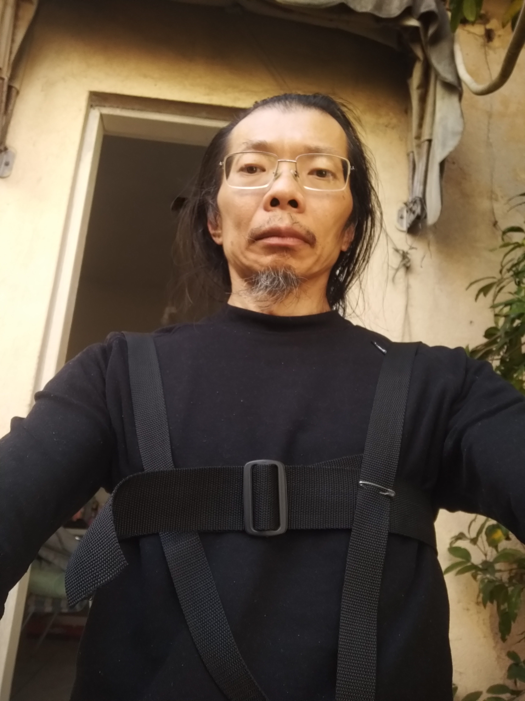

# Suporte para peito e costas

**nota**: Eu estava escrevendo este arquivo, que deveria ser o relatório, mas dei uma pausa (de quase um mês) e houve novidades em outras frentes. Desta forma, vou completar sumariamente este documento, o documento do *color timer* e saltar para a novidade.

## Motivação

Faz muito tempo que quero fazer algo que se pareça com um *color timer* do Ultraman, ou com o *reator arc* do Homem-de-Ferro.

Faz umas duas semanas (em 2021-07-20) que comecei a fazer algo. Logo de início percebi que posso, talvez precise, repartir em dois sub-projetos:

1. Suporte peitoral (este projeto);
2. Luz, Difusor, eletrônica (projeto [Color Timer](colorTimer)).

Os resultados dos sub-projetos podem ser usados separadamente. Sua construção requer habilidades diferentes. Por isso acho conveniente separar em dois.

## Materiais

1. [Alça PP 50mm](https://produto.mercadolivre.com.br/MLB-1001173327-alca-cadarco-ca-preto-polipropileno-50mm-rolo-50-metros-_JM?quantity=1)
2. [Alça PP 30mm](https://produto.mercadolivre.com.br/MLB-996570080-alca-cadarco-ca-bolsas-mochilas-preto-30mm-rolo-50-metros-_JM?quantity=1&variation_id=33082744624)
3. [Regulador para a largura da alça usada](https://produto.mercadolivre.com.br/MLB-1082468221-regulador-passador-plastico-preto-50mm-100-un-_JM?quantity=1)
3. agulha, linha, tesoura (ferramentas para costura);
4. alfinetes de segurança;
5. chama (isqueiro, ou vela ou fósforo);

## Método

Experimental, incremental, tentativa e erro.

1. Suporte com apoio no pescoço;
2. Apoio no pescoço e faixa no peito;
3. Suporte com alças nos ombros e faixa no peito;

Marcar o lugar do corte das alças dobrando a alça para evidenciar uma linha reta, cortar com tesoura, derreter a ponta da alça com a chama para evitar que desfie.

Quando possível, fazer as emendas com alfinete de segurança.

Tentar vestir pelo dia inteiro (caso incomode, tire e anote o motivo).

## Resultados

### Suporte com apoio no pescoço

Passei a alça no pescoço, medi para a ponta ficar no lugar onde eu queria, de maneira que fosse possível passar a cabeça pela alça, marquei com alfinete, testei tirar, cortei e uni as pontas no lugar marcado. Vou chamar isso de *colar*. Para registro, o comprimento da tira é 71cm. As fotos são grandes por isso deixo links ao invés de carregar.

[Apoio no pescoço 1](IMG_20210720_094437709.jpg)

[Apoio no pescoço 2](IMG_20210720_094523478.jpg)

Somente com o apoio no pescoço, a ponta do *colar* se distancia do corpo quando dobra-se o tronco. Eu não quero isso. Então acrescentei uma faixa de peito fechada com ajustador e presa com alfinete de segurança.

[Ajustador e forma que usei para fixar faixa no peito](IMG_20210720_103518282.jpg)

[Apoio no pescoço - faixa no peito](IMG_20210720_102447272.jpg)

Com apoio no pescoço e faixa no peito, se a faixa no peito tiver folga, com o peso da própria faixa e o único apoio no apoio no pescoço, a folga acaba abrindo (distância entre o peito e a faixa. Também notei que o colar incomoda no pescoço, chega a arranhar, pois o material é muito áspero.

[Apoio no pescoço - folga por inclinação da faixa no peito - vista geral](IMG_20210720_102947228.jpg)
 
[Folga por inclinação da faixa no peito - detalhe](IMG_20210720_103020554.jpg)

### Suporte com alças nos ombros

Resolvi mudar para alças nos ombros. Desta forma não há atrito com o pescoço e o equilíbrio da faixa de peito é melhor.

A cinta do peito tem 120cm, as alças dos ombros tem 75cm. De um alfinete a outro, uma alça tem 53cm e outra 51cm.

[Construção](20210806_193717.jpg)

[No corpo ficou assim](IMG_20210720_120044369.jpg)

Este modelo, com abertura no centro do peito, é mais fácil de vestir que o próximo, com abertura lateral. Acontece que como quero que o dispositivo fique no centro do peito, não é conveniente que o ajustador fique nesse lugar.

Passei o dia todo com ela e foi confortável.

### Tamanho da carga

Fui cuidar de definir o que carregar no suporte. Por causa do projeto do [color timer](), achei razoável que fosse bateria, protoboard e arduino mega, então juntei e medi. O resultado da medida é aprox. 13cm X 20cm.

[Foto 1](IMG_20210724_101756389.jpg)

[Foto 2](IMG_20210724_101848569.jpg)

### Suporte rígido no peito

A primeira idéia ocorreu antes de pensar em o que carregar na placa. Foi de um suporte triangular, inspirado no emblema do peito dos personagens de histórias em quadrinhos, mas é pequeno para o que eu queria carregar. Eu também não sabia como fixar a placa no peito. Usei peças [modelix](https://www.modelix.com.br/kit-robotica-ensino-medio) e [xapadur perfurado](https://www.leomadeiras.com.br/product/prod-3-Xapadur_Perfurado_2750x1220x25mm_Eucatex).

[Primeira Idéia](IMG_20210815_101656335.jpg)

Agora considerando o tamanho da carga, os pedaços de xapadur que tenho e a condição de não gastar esforço para alargar furos para passar as alças, cheguei ao desenho da foto.

[Medidas](IMG_20210815_100830514.jpg)

A chapa tem 24cm de altura e 28,5cm de largura. As alças dos ombros estão a 23cm de distância uma da outra, medido centro a centro. Da intersecção da cinta do peito com a alça do ombro até o alto do ombro são 29cm. Dessa mesma intersecção até a lateral do peito são 12cm. 

[Colocada no corpo - de frente](IMG_20210815_101351960.jpg)

[Colocada no corpo - lateral](IMG_20210815_101415802.jpg)

[Colocada no corpo - costas (no espelho)](IMG_20210815_101519481.jpg)

Este ficou bastante desajeitado. A placa é grande demais e atrapalha os movimentos.

## Comentários, Conclusões, Discussão

A novidade é que, em outra frente, coloquei para funcionar um LED em uma placa de 5x5cm, que pode ser pendurada no suporte e não precisa da placa.

