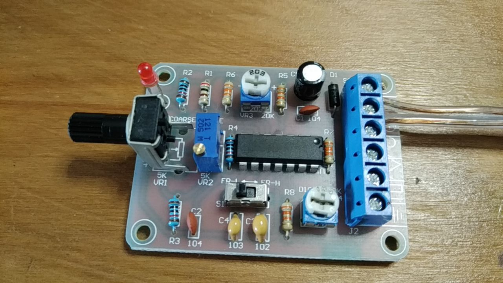

## Motivation

A waveform generator is useful to test audio circuits and study analog circuits transfer functions.

There exists an affordable waveform generator from some e-commerce marketplaces (1, 2, 3) All of them are based on ICL8038 (4) 

The component is well documented but the particular (affordable) board is not.

## Objectives

Add information about the particular board by:
  
1. Building a kit
2. Analysing it

## Results

### Build

The kit comes with all components: IC, resistors, capacitors, switches and connectors to be assembled on the printed circuit board (PCB). Component placement on the PCB is drawn on it. Remarks: PCB is marked with a $100\mu F$ electrolitic capacitor while the kit is shipped with a $220\mu F$ one. The precision trimpot may be placed in any orientation (https://components101.com/resistors/3296-trimmer-potentiometer-pinout-datasheet)

Usual DIY soldering equipment is sufficient.

No need to enlarge PCB eyelets.

### Operate

12V power source is necessary. ICL8038 do not operate below 10V (or symmetric +-5V).

Connect power source to Pins (+) and (-). The LED turns on, signals are generated on all (three) outputs.

The switch configures frequency generation ranges (FR-L for low frequencies) (FR-H for high frequencies).

$20k\Omega$ (203) trimpot changes square-wave duty cycle and triangle-wave raise/fall symmetry.

$100k\Omega$ (104) trimpot changes sine wave up/down symmetry

### Measure

Multi-turn trimpot adjusted to minimum frequency

| frequency switch setting | potentiometer set minimum freq | potentiometer set maximum freq | comments |
| --- | --- | --- | --- |
| FR-L | 43.8 | 55.1 | visually low distortion. triangle is triangle and sine is sine waveforms |
| FR-H | 260 | 465 | visually very distorted sine and triagle waveforms. Both look like sawtooth (capacitor charge-discharge cicles even in DC coupling) |

Multi-turn trimpot adjusted to maximum frequency
| frequency switch setting | potentiometer set minimum freq | potentiometer set maximum freq | comments |
| --- | --- | --- | --- |
| FR-L | 55.8 | 740 | visually low distortion. triangle is a little bit relaxed and sine is sine waveforms |
| FR-H | 465 | 7.48k | visually very distorted sine and triagle waveforms. Both look like sawtooth (capacitor charge-discharge cicles even in DC coupling) distortion is more visible at LOW frequencies |

| waveform | $V_{min}$ | $V_{max}$ |
| --- | --- | --- |
| sine | 4.8 | 7.3 |
| triang | 4 | 8 |
| square| 0 | 12.08 |

freq.: 400Hz
duty cycle: 50%

## Comments

Large DC offset: the circuit produces waveforms not symmetric around 0V nor starting (near) 0V.

Large distortion in some settings

| --- | FR-L | FR-L | FR-H | FR-H |
| --- | --- | --- | --- | --- |
| pot min | low | low | high | high |
| pot max | low | low | low | high |
| multi-turn | min | max | max | min |

from above Karnaugh map: any setting with FR-L is ok, "high" frequencies with multi-turn trimpot adjusted to maximum is ok. Adjusting multi-turn trimpot is cumbersome so stuck it in max.

| --- | FR-L | FR-H |
| --- | --- | --- |
| pot min | low | high |
| pot max | low | low |
| multi-turn | max | max |

In this case frequency ranges from 55.8-740 (FR-L) and from 465-7480 (high distortion in low frequencies)

$20k\Omega$ (203) trimpot changes square-wave duty cycle, sine and triangle-wave raise/fall symmetry.

$100k\Omega$ (104) trimpot changes sine wave up/down symmetry - looks like some kind of nonlinear clamping which makes sawtooth waveform look like sinewave. When duty-cicle is locked in 50% the best looking "sinewave" is a symmetric sawtooth (in my oppinion) ...

Low cost circuit applicable in AC circuits (filter DC out with a capacitor, reduce voltage with a voltage divider).

To use it in DC circuits needs additional circuit to set signal offset and amplitude.
 

References:
  
1. https://produto.mercadolivre.com.br/MLB-1911566158-placa-montada-gerador-funcoes-quadrada-senoidal-triangular-_JM
2. https://produto.mercadolivre.com.br/MLB-3427198604-gerador-de-funcoes-sinal-kit-para-montar-ci-icl8038-_JM
3. https://pt.aliexpress.com/item/1005002435073715.html
4. https://www.mit.edu/~6.331/icl8038data.pdf
5. https://www.instructables.com/DIY-Function-Generator-ICL8038-0-Hz-400Khz/
6. https://chinese-electronics-products-tested.blogspot.com/p/icl8038-function-generator-kit-tested.html
